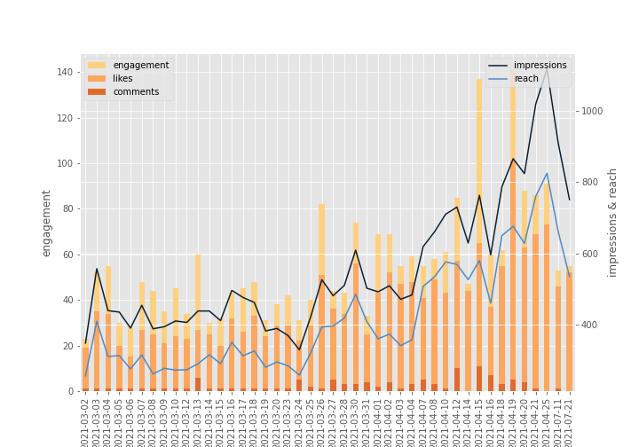

# Instagram Statistics Tracker
Track and visualize your instagram business account without any effort!

## Usage

###### Get your own instagram business account id and token
In order to use the [Instagram Graph API](https://developers.facebook.com/docs/instagram-api/), you will need to generate a id and a token for your instagram business account. After acquiring them, change the `data/info.txt` file so that the program can use your id and token to fetch the information you need.

###### Use these 3 simple functions
You can find an extremely simple example in the `instagram_stats.ipynb` notebook of the usage of the following functions.

`get_user_info(path)`: Specify the path to you `info.txt` file and get your user information. The output will be stored inside `data/user_info.csv`.

`get_media_info(path)`: Specify the path to you `info.txt` file and get all the information on your media content. The output will be stored inside `data/media_info.csv`.

`display(media_info)`: Pass the media info generate from the above function visualize your media information.